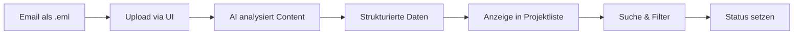
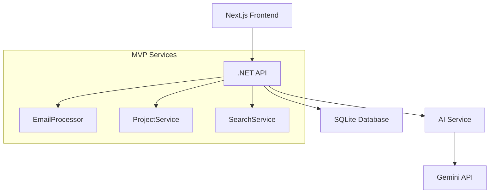

# Project Acquisition System - MVP Spezifikation

## MVP-Ziel

**Kernproblem**: 50-200 Projektangebote pro Woche, aber nur ein Bruchteil wird gesichtet → interessante Opportunities gehen unter

**MVP-Lösung**: Alle eingehenden Projektangebote strukturiert erfassen, AI-basiert analysieren und durchsuchbar machen, damit keine Opportunity mehr untergeht.

## MVP-Scope

### ✅ In Scope (MVP)
1. **Email-Import**: .eml File Upload (copy/paste interface)
2. **AI-Datenextraktion**: Strukturierte Extraktion von Projektdaten aus Email-Content
3. **Strukturierte Speicherung**: Zentrale Datenbank für alle Projekte
4. **Basic UI**: Übersichtsliste aller Projekte mit Grundinformationen
5. **Einfache Suche**: Text-basierte Suche durch alle Projektdaten
6. **Status-Tracking**: "Neu", "Gesehen", "Interessant", "Nicht relevant"

### ❌ Out of Scope (MVP)
- Automatisches Email-Monitoring
- Web-Crawling von verlinkten Seiten
- Komplexe Task-Orchestrierung
- Tag-System mit Gewichtung
- Deduplication
- Agency/Customer-Management
- Historische Analyse-Features

## MVP User Journey



## Vereinfachtes Datenmodell (MVP)

### Entities

#### RawLead (Vereinfacht)
- `id`: string (GUID)
- `original_content`: text (komplette .eml)
- `uploaded_at`: datetime
- `processing_status`: enum (Processing, Completed, Failed)

#### Project (Vereinfacht - ersetzt "Job")
- `id`: string (GUID)
- `raw_lead_id`: string (FK)
- `title`: string (AI-extrahiert)
- `description`: text (AI-extrahiert)
- `technologies`: string (comma-separated, AI-extrahiert)
- `location`: string (AI-extrahiert)
- `remote_possible`: boolean (AI-extrahiert)
- `duration`: string (AI-extrahiert)
- `budget_info`: string (AI-extrahiert)
- `contact_info`: string (AI-extrahiert)
- `source_type`: string (email, platform, etc.)
- `user_status`: enum (New, Seen, Interesting, NotRelevant)
- `extracted_at`: datetime
- `user_notes`: text (optional)

## MVP Architektur

### Komponenten



### Service-Verantwortlichkeiten

#### EmailProcessor
- .eml File parsing
- Content-Extraktion (Headers, Body, Attachments)
- Aufruf des AI-Service für Datenextraktion

#### AI Service
- Gemini API Integration
- Prompt Engineering für Datenextraktion
- Strukturierte Rückgabe von Projektdaten

#### ProjectService
- CRUD-Operationen für Projects
- Status-Management
- Basic Business Logic

#### SearchService
- Volltext-Suche durch alle Projektfelder
- Einfache Filterung nach Status

## MVP UI/UX

### Hauptseiten

1. **Upload-Seite**
   - Drag & Drop für .eml Files
   - Upload-Progress
   - Fehlermeldungen

2. **Projekt-Übersicht**
   - Tabellen-View aller Projekte
   - Sortierung nach Upload-Datum (neueste zuerst)
   - Status-Icons (Neu, Gesehen, etc.)
   - Schnell-Actions (Status ändern)

3. **Projekt-Detail**
   - Alle extrahierten Daten
   - Original Email-Content
   - Notes-Feld
   - Status-Management

4. **Suche**
   - Einfaches Suchfeld
   - Filter nach Status
   - Ergebnisliste

### Wireframe Konzept

```
┌─────────────────────────────────────────┐
│ Project Radar - MVP                     │
├─────────────────────────────────────────┤
│ [Upload] [Projects] [Search]            │
├─────────────────────────────────────────┤
│                                         │
│ Recent Projects:                        │
│                                         │
│ [●] React Developer - Berlin - NEW      │
│ [✓] .NET Architect - Remote - SEEN      │
│ [★] Python ML Engineer - Hamburg - INT  │
│ [×] PHP Project - Munich - NOT REL      │
│                                         │
│ Search: [_________________] [Filter ▼]  │
│                                         │
└─────────────────────────────────────────┘
```

## Technische Details

### Technology Stack
- **Frontend**: Next.js 14+ (App Router)
- **Backend**: .NET 9 Web API
- **Database**: SQLite (Produktion & Entwicklung)
- **AI**: Google Gemini 1.5 Pro
- **Deployment**: Lokal (kein Docker)
- **Authentication**: Keine (nur lokale Nutzung)
- **File Storage**: .eml Files in SQLite Database

### AI-Prompting Strategie

**Ziel**: Strukturierte Extraktion von Projektdaten aus Email-Content

**Input**: Vollständiger Email-Content (.eml geparsed)
**Output**: JSON mit standardisierten Feldern

**Prompt-Template** (Konzept):
```
Analysiere die folgende Projekt-Email und extrahiere strukturierte Daten:

EMAIL CONTENT:
{email_content}

Extrahiere folgende Informationen als JSON:
{
  "title": "Projekttitel",
  "description": "Kurze Beschreibung",
  "technologies": ["Tech1", "Tech2"],
  "location": "Standort",
  "remote_possible": true/false,
  "duration": "Projektdauer",
  "budget_info": "Budget/Tagessatz Info",
  "contact_info": "Kontaktdaten",
  "source_type": "email/platform/agency"
}
```

## MVP Success Criteria

### Funktional
- ✅ .eml Files können hochgeladen werden
- ✅ AI extrahiert sinnvolle Projektdaten (>80% Qualität)
- ✅ Alle Projekte werden in übersichtlicher Liste angezeigt
- ✅ Suche findet relevante Projekte
- ✅ Status kann geändert werden

### Non-Funktional
- ✅ Verarbeitung eines Projekts < 10 Sekunden
- ✅ UI ist responsive und intuitiv bedienbar
- ✅ System läuft stabil auf deinem lokalen Rechner

## MVP Implementation Plan

### 🚀 AI-Accelerated 1-Day Implementation

**Mit 30 Jahren Erfahrung + AI-Unterstützung: 1 Arbeitstag**

#### Morgen: Backend (4 Stunden)
- .NET 9 Web API Setup (30 min)
- SQLite + Entity Framework Setup (30 min)
- EmailProcessor für .eml Parsing (90 min)
- Gemini AI Service Integration (90 min)

#### Nachmittag: Frontend (4 Stunden)
- Next.js 14 Setup mit TypeScript (30 min)
- Upload-Interface mit Drag & Drop (60 min)
- Projekt-Übersicht + Detail-View (90 min)
- Suche + Status-Management (60 min)

## Erweiterungen nach MVP

### Phase 2 Features (nach MVP Testing)
- Email-Monitoring (automatisch)
- Deduplication
- Agency/Customer-Tracking
- Tag-System

### Phase 3 Features
- Historische Analyse
- Skill-Matching
- Advanced Filtering
- Export-Funktionen

---

## Next Steps

1. ✅ MVP Spec finalisiert
2. 🔄 .NET Backend Setup JETZT
3. 🔄 Database Schema Implementation
4. 🔄 EmailProcessor Development
5. 🔄 AI Service Integration

**Realisistische MVP-Entwicklungszeit**: 1 Arbeitstag
**Geschätzter MVP-Aufwand**: ~8 Stunden (mit AI-Unterstützung)
