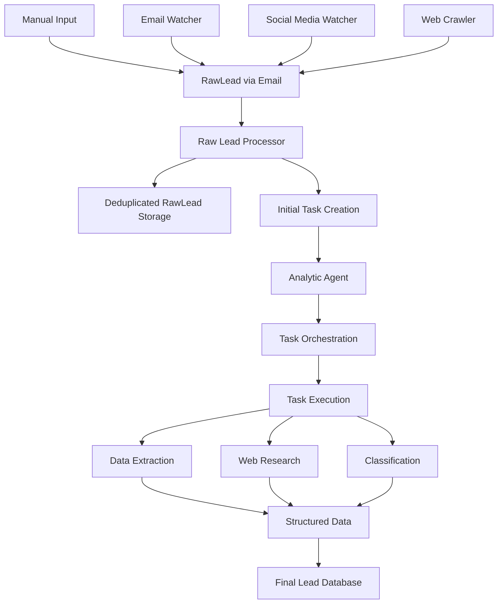
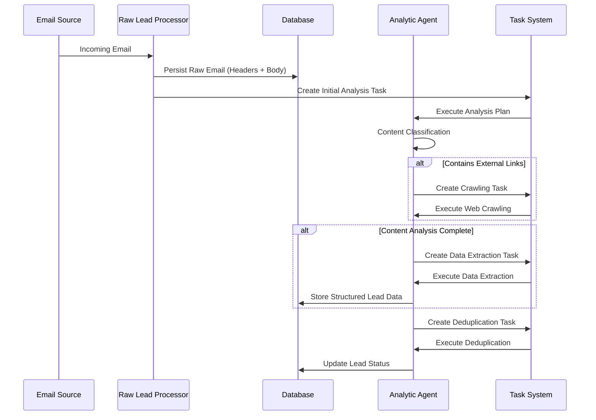
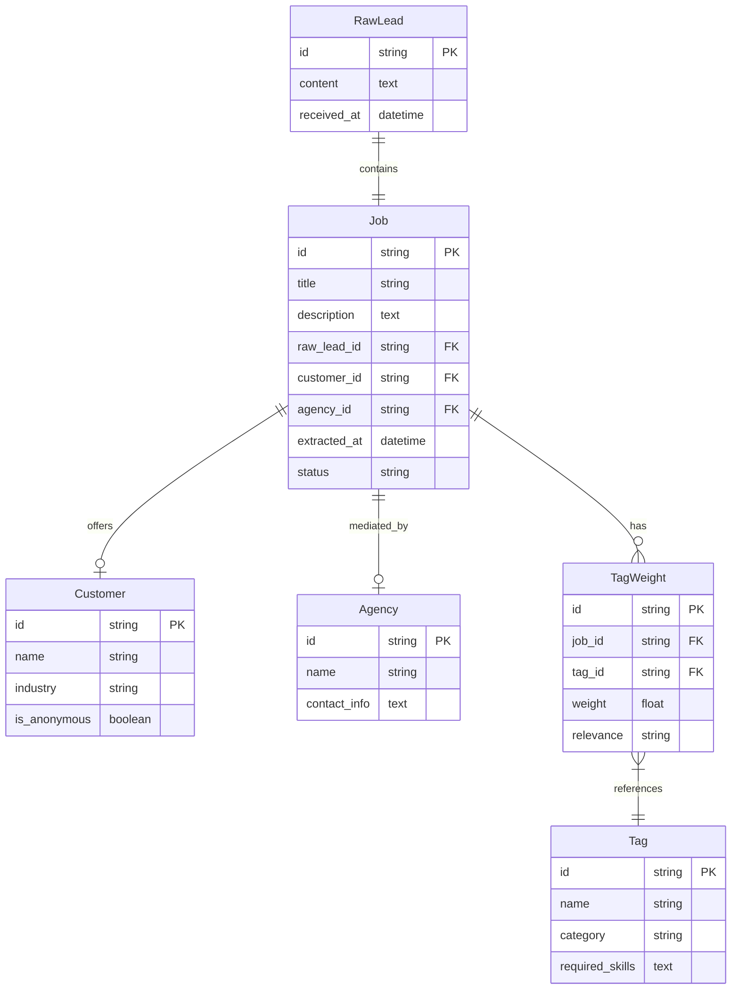
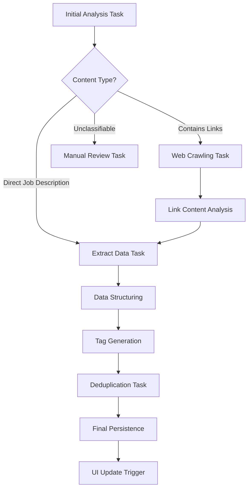
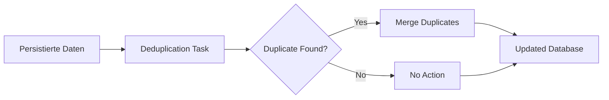

# AI-Agentic Project Acquisition System - Spezifikation

## Überblick

Ein spezialisiertes Mini-CRM System zur automatisierten Akquise und Analyse von Softwareentwicklungs- und Consulting-Projekten. Das System fungiert als Aggregator für verschiedene Lead-Quellen und nutzt AI-Agenten zur intelligenten Verarbeitung und Aufbereitung von Projektangeboten.

## Projektziele

- **Primärziel**: Systematische Übersicht und Analyse aller verfügbaren Projekte aus verschiedenen Quellen
- **Sekundärziel**: Bessere Projektauswahl durch datengetriebene Entscheidungen statt "lauteste" oder "bestbezahlte" Projekte
- **Langfristig**: Vollautomatisierte Bewerbungsabwicklung und CRM-Integration

## Lead-Quellen

### Aktuelle Quellen
- **Agenturen**: Haze, Accenture, diverse kleinere Vermittlungsagenturen
- **Social Media**: XING, LinkedIn
- **Plattformen**: freelancer.de, freelancerweb
- **Sonstige**: E-Mail-basierte Angebote

### Verarbeitungsansatz
- **Nur E-Mail-basiert**: Alle Quellen werden über E-Mails verarbeitet
- **Kein API-Zugriff**: Bewusster Verzicht auf Plattform-APIs
- **Email-Scanning**: Out of Scope - System startet ab eingehender E-Mail

## System-Architektur

### High-Level Datenfluss

### Detaillierter Verarbeitungsprozess

## Kern-Komponenten

### 1. Raw Lead Processor
**Funktion**: Erste Verarbeitungsstufe für eingehende E-Mails
- Persistierung der kompletten E-Mail als Content
- Erstellung des initialen Analyse-Tasks
- Keine Datenextraktion oder -verarbeitung

### 2. Analytic Agent
**Funktion**: KI-basierte Task-Orchestrierung und -Ausführung
- Erstellt Ausführungspläne basierend auf Inhaltsanalyse
- Koordiniert abhängige Tasks
- Hauptsächlich als Task-Scheduler konzipiert

### 3. Task-System
**Kern-Task-Typen**:
- **Content Analysis**: Klassifizierung des E-Mail-Inhalts
- **Web Crawling**: Extraktion von Jobs aus verlinkten Webseiten
- **Data Extraction**: Strukturierte Datenextraktion aus Rohdaten
- **Deduplication**: Erkennung und Behandlung von Duplikaten
- **Classification**: Tagging und Kategorisierung

**Task-Eigenschaften**:
- Abhängigkeiten zwischen Tasks möglich
- Sequentielle Ausführung bei Dependencies
- Parallelisierung bei unabhängigen Tasks

## Datenmodell

### Entity-Relationship Übersicht

### Kernentitäten

#### RawLead
- Rohe E-Mail-Persistierung (nur Content)
- Minimale Metadaten (Received_at)
- 1:1 Beziehung zum Job

#### Agency
- Vermittlungsagentur-Identifikation (optional)
- Kontaktinformationen
- Unabhängig von RawLead-Zuordnung

#### Customer
- Endkunde (optional, falls identifizierbar)
- Anonymitäts-Flag für ungenannte Kunden
- Direkte Zuordnung zum Job

#### Job
- Zentrale Entität mit extrahierten Daten
- Verbindung zu RawLead (1:1)
- Optionale Verbindungen zu Customer und Agency
- Basis für Tag-Zuordnungen

#### Tag/TagWeight System
- Job kann 0 bis N TagWeights haben
- Jeder TagWeight referenziert genau einen Tag
- Skill-basiertes Tagging mit Gewichtung

## Task-Orchestrierung

### Execution Plan Beispiel

### Task-Dependencies
- **Sequential**: Crawling → Content Analysis → Data Extraction
- **Parallel**: Tag Generation und Customer Identification (nach Data Extraction)
- **Final**: Deduplication als letzter Schritt vor Persistierung

## Deduplication-Strategie

### Ansatz
- **Timing**: Kann jederzeit als separater Task ausgeführt werden
- **Implementation**: Als unabhängiger Task im Task-System
- **Methode**: Merge-basierte Zusammenführung von Duplikaten
- **Persistierung**: Daten werden immer normal persistiert, Deduplizierung erfolgt nachgelagert

### Deduplizierung als Merge-Task

## User Interface Ziele

### Primäre Funktionen
- **Einheitliche Darstellung**: Alle Leads aus verschiedenen Quellen in konsistentem Format
- **Filterung und Suche**: Tag-basierte Filterung nach Skills und Kriterien
- **Historische Analyse**: Übersicht über vergangene Angebote von Kunden/Agenturen
- **Status-Tracking**: Verarbeitungsstatus der einzelnen Leads

### Zukünftige Erweiterungen (Out of Scope)
- Automatische Bewerbungsgenerierung
- CRM-Integration
- Skill-Matching und Scoring
- Automatisierte Kontaktaufnahme

## Technische Rahmenbedingungen

### Technology Stack
- **Frontend**: Next.js
- **Backend**: .NET 9
- **Deployment**: Lokal, später containerisiert
- **LLM Provider**: Google Gemini 25 (konfigurierbar)

### Architektur-Prinzipien
- **LLM-Abstraction**: Konfigurierbare Provider ohne externe Frameworks
- **Dependency Injection**: Standard .NET Patterns
- **Task-based Processing**: Async/await Patterns
- **Email-centric**: Alle Eingänge über E-Mail-System

## Scope-Abgrenzung

### In Scope (Phase 1)
- E-Mail Processing ab eingehender Nachricht
- Task-basierte AI-Agents
- Datenextraktion und -strukturierung
- Basic UI für Lead-Übersicht
- Deduplication-System

### Out of Scope (Phase 1)
- E-Mail-Scanning und -Überwachung
- Skill-Matching und Scoring
- Automatische Bewerbungsgenerierung
- CRM-Funktionalitäten
- API-Integration mit externen Plattformen

## Nächste Schritte

1. **Datenmodell-Refinement**: Detaillierte Feldspezifikation
2. **Task-System Design**: Konkrete Task-Typen und Interfaces
3. **LLM-Integration**: Prompt Engineering und Provider-Abstraktion
4. **UI/UX Design**: Wireframes und User Flows
5. **Implementation Planning**: Sprint-Planung und Meilensteine