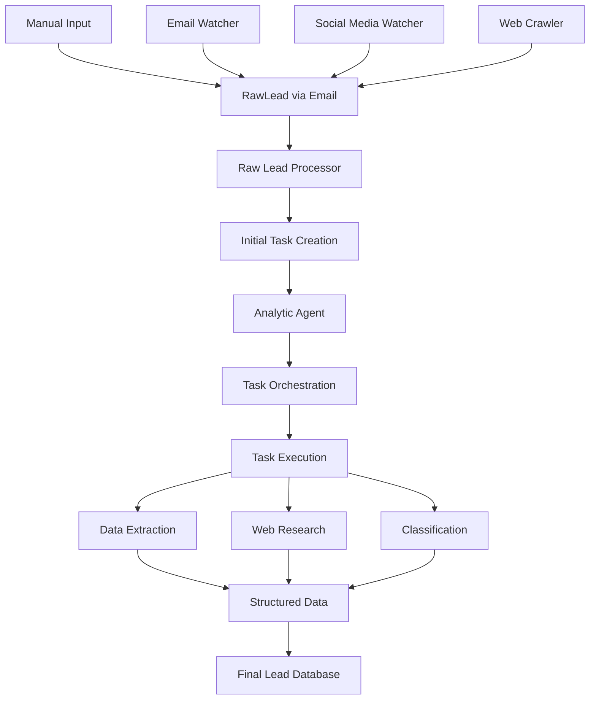

# AI-Agentic Project Acquisition System - Spezifikation

## Überblick

Ein spezialisiertes Mini-CRM System zur automatisierten Akquise und Analyse von Softwareentwicklungs- und Consulting-Projekten. Das System fungiert als Aggregator für verschiedene Lead-Quellen und nutzt AI-Agenten zur intelligenten Verarbeitung und Aufbereitung von Projektangeboten.

## Projektziele

- **Primärziel**: Systematische Übersicht und Analyse aller verfügbaren Projekte aus verschiedenen Quellen
- **Sekundärziel**: Bessere Projektauswahl durch datengetriebene Entscheidungen statt "lauteste" oder "bestbezahlte" Projekte. Automatische Notifications bei "Traumjobs"
- **Langfristig**: Vollautomatisierte Bewerbungsabwicklung und CRM-Integration

## Lead-Quellen

### Aktuelle Quellen
- **Agenturen**: Hays, Accenture, diverse kleinere Vermittlungsagenturen
- **Social Media**: XING, LinkedIn
- **Plattformen**: freelancer.de, freelancerweb
- **Sonstige**: E-Mail-basierte Angebote

### Verarbeitungsansatz
- **Nur E-Mail-basiert**: Alle Quellen werden über E-Mails verarbeitet
- **Kein API-Zugriff**: Bewusster Verzicht auf Plattform-APIs
- **Email-Scanning**: Out of Scope - System startet ab eingehender E-Mail

## System-Architektur

### High-Level Datenfluss

## Kern-Komponenten

### 1. Raw Lead Processor
**Funktion**: Erste Verarbeitungsstufe für eingehende E-Mails
- Persistierung der kompletten E-Mail als Content
- Erstellung des initialen Analyse-Tasks
- Keine Datenextraktion oder -verarbeitung

### 2. Analytic Agent
**Funktion**: KI-basierte Task-Orchestrierung und -Ausführung
- Erstellt Ausführungspläne basierend auf Inhaltsanalyse
- Koordiniert abhängige Tasks
- Hauptsächlich als Task-Scheduler konzipiert

### 3. Task-System
**Kern-Task-Typen**:
- **Content Analysis**: Klassifizierung des E-Mail-Inhalts
- **Web Crawling**: Extraktion von Jobs aus verlinkten Webseiten
- **Data Extraction**: Strukturierte Datenextraktion aus Rohdaten
- **Deduplication**: Erkennung und Behandlung von Duplikaten
- **Classification**: Tagging und Kategorisierung

**Task-Eigenschaften**:
- Abhängigkeiten zwischen Tasks möglich
- Sequentielle Ausführung bei Dependencies
- Parallelisierung bei unabhängigen Tasks

## Technische Rahmenbedingungen

### Technology Stack
- **Frontend**: Next.js
- **Backend**: .NET 8
- **Deployment**: Lokal, später containerisiert
- **LLM Provider**: OpenAI (später konfigurierbar)

### Architektur-Prinzipien
- **LLM-Abstraction**: Konfigurierbare Provider ohne externe Frameworks
- **Dependency Injection**: Standard .NET Patterns
- **Task-based Processing**: Async/await Patterns
- **Email-centric**: Alle Eingänge über E-Mail-System

## Scope-Abgrenzung

### In Scope (Phase 1)
- E-Mail-Scanning und -Überwachung
- E-Mail Processing ab eingehender Nachricht
- Task-basierte AI-Agents
- Datenextraktion und -strukturierung
- Basic UI für Lead-Übersicht
- Deduplication-System

### Out of Scope (Phase 1)
- Skill-Matching und Scoring
- Automatische Bewerbungsgenerierung
- CRM-Funktionalitäten
- API-Integration mit externen Plattformen