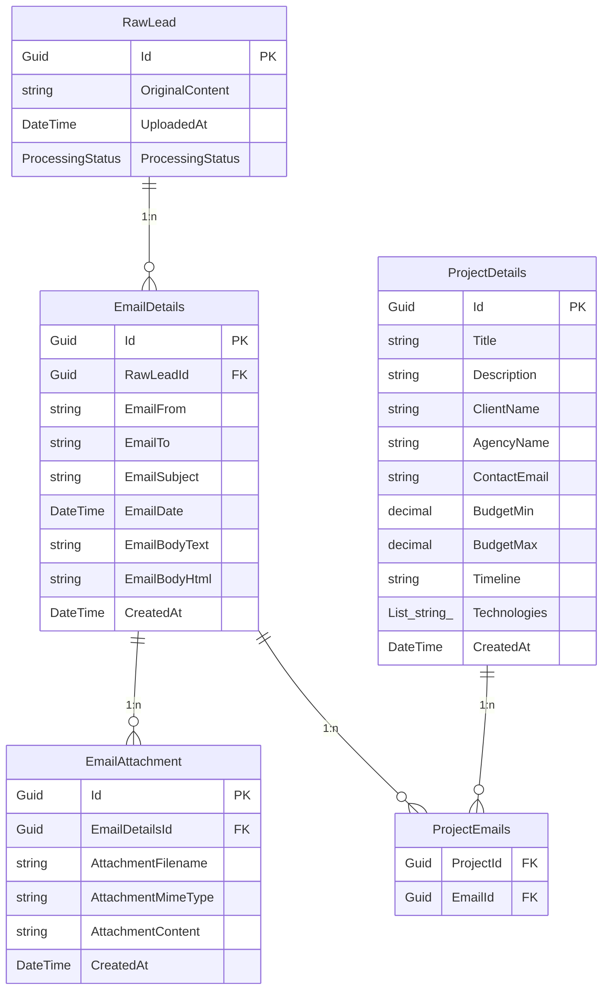

# NTLT ProjectRadar System Overview

## Backend

### Persistence: Database Structure

Das Backend verwendet SQLite als Datenbank mit Entity Framework Core. Die Datenstruktur umfasst folgende Entitäten:

### API / Endpoints / DTOs

#### Controllers und Endpoints

| Controller | Endpoint | HTTP Method | Description |
|------------|----------|-------------|-------------|
| RawLeadsController | `/api/rawleads` | GET | Get all RawLeads with optional status filter |
| RawLeadsController | `/api/rawleads/{id}` | GET | Get specific RawLead by ID |
| RawLeadsController | `/api/rawleads/upload` | POST | Upload .eml file and create new RawLead |
| RawLeadsController | `/api/rawleads/{id}/status` | PATCH | Update processing status of RawLead |
| RawLeadsController | `/api/rawleads/{id}` | DELETE | Delete RawLead |
| EmailsController | `/api/emails` | GET | Get paginated list of emails |
| EmailsController | `/api/emails/{id}` | GET | Get detailed email information |
| EmailsController | `/api/emails/attachments/{attachmentId}` | GET | Download email attachment |
| ProjectsController | `/api/projects` | GET | Get all projects |
| ProjectsController | `/api/projects/{id}` | GET | Get project by ID |
| ProjectsController | `/api/projects` | POST | Create new project |
| ProjectsController | `/api/projects/{id}` | PUT | Update existing project |
| ProjectsController | `/api/projects/{id}` | DELETE | Delete project |
| ProjectsController | `/api/projects/by-email/{emailId}` | GET | Get projects linked to specific email |
| ProjectsController | `/api/projects/link-email` | POST | Link project to email |
| ProjectsController | `/api/projects/unlink-email` | DELETE | Unlink project from email |
| ProjectsController | `/api/projects/extract-from-email/{emailId}` | POST | Extract and create project from email |

#### DTOs

| DTO | Properties | Type |
|-----|------------|------|
| EmailAttachmentDto | Id, AttachmentFilename, AttachmentMimeType, AttachmentContent, CreatedAt | Guid, string, string, string, DateTime |
| EmailDetailsDto | Id, RawLeadId, EmailFrom, EmailTo, EmailSubject, EmailDate, EmailBodyText, EmailBodyHtml, CreatedAt, Attachments | Guid, Guid, string, string, string, DateTime?, string, string, DateTime, IEnumerable<EmailAttachmentDto> |
| EmailAttachmentListDto | Id, AttachmentFilename, AttachmentMimeType | Guid, string, string |
| EmailListDto | Id, EmailFrom, EmailTo, EmailSubject, EmailDate, CreatedAt, HasAttachments, Attachments | Guid, string, string, string, DateTime?, DateTime, bool, IEnumerable<EmailAttachmentListDto> |
| EmailListResponseDto | Emails, TotalCount, Page, PageSize, TotalPages, HasNextPage, HasPreviousPage | IEnumerable<EmailListDto>, int, int, int, int, bool, bool |
| ProjectDetailsDto | Id, Title, Description, ClientName, AgencyName, ContactEmail, BudgetMin, BudgetMax, Timeline, Technologies, CreatedAt | Guid, string?, string?, string?, string?, string?, decimal?, decimal?, string?, List<string>, DateTime |
| CreateProjectDetailsDto | Title, Description, ClientName, AgencyName, ContactEmail, BudgetMin, BudgetMax, Timeline, Technologies | string?, string?, string?, string?, string?, decimal?, decimal?, string?, List<string> |
| UpdateProjectDetailsDto | Title, Description, ClientName, AgencyName, ContactEmail, BudgetMin, BudgetMax, Timeline, Technologies | string?, string?, string?, string?, string?, decimal?, decimal?, string?, List<string> |
| ProjectEmailLinkDto | ProjectId, EmailId | Guid, Guid |

### Background Services

| Service | Funktion |
|---------|----------|
| EmailProcessingBackgroundService | Verarbeitet RawLeads mit Status "Processing" automatisch. Parst E-Mail-Inhalte mit MimeKit, extrahiert Anhänge, erstellt EmailDetails und versucht Projektdaten mit AI-Service zu extrahieren. Aktualisiert Status auf "Completed" oder "Failed". |

## Frontend

### API connection

#### Verwendete Endpunkte im apiService.ts

| Methode | Endpoint | HTTP Method | Diskrepanz zur Backend-API |
|---------|----------|-------------|---------------------------|
| uploadEmlFile | `/api/rawleads/upload` | POST | ✓ Stimmt überein |
| getRawLead | `/api/rawleads/{id}` | GET | ✓ Stimmt überein |
| getRawLeads | `/api/rawleads` | GET | ✓ Stimmt überein |
| updateProcessingStatus | `/api/rawleads/{id}/status` | PATCH | ✓ Stimmt überein |
| deleteRawLead | `/api/rawleads/{id}` | DELETE | ✓ Stimmt überein |
| getEmails | `/api/emails` | GET | ✓ Stimmt überein |
| getEmailById | `/api/emails/{id}` | GET | ✓ Stimmt überein |
| downloadAttachment | `/api/emails/attachments/{attachmentId}` | GET | ✓ Stimmt überein |
| getProjects | `/api/projects` | GET | ✓ Stimmt überein |
| getProjectById | `/api/projects/{id}` | GET | ✓ Stimmt überein |
| createProject | `/api/projects` | POST | ✓ Stimmt überein |
| updateProject | `/api/projects/{id}` | PUT | ✓ Stimmt überein |
| deleteProject | `/api/projects/{id}` | DELETE | ✓ Stimmt überein |
| getProjectsByEmail | `/api/projects/by-email/{emailId}` | GET | ✓ Stimmt überein |
| linkEmailToProject | `/api/projects/{projectId}/emails/{emailId}` | POST | ❌ Backend: `/api/projects/link-email` (POST mit Body) |
| unlinkEmailFromProject | `/api/projects/{projectId}/emails/{emailId}` | DELETE | ❌ Backend: `/api/projects/unlink-email` (DELETE mit Body) |

**Diskrepanzen:** 
- Frontend verwendet URL-Parameter für Projekt-Email-Verknüpfungen, Backend erwartet Request Body mit ProjectEmailLinkDto
- Fehlende Frontend-Methode für `/api/projects/extract-from-email/{emailId}` Endpoint

### Pages

| Route | Funktionalität |
|-------|----------------|
| `/` | Homepage mit Hero-Section, Übersicht über System-Features und Navigation zu Hauptfunktionen |
| `/upload` | Upload-Seite für .eml Dateien mit Drag&Drop-Zone, Progress-Anzeige und Fehlermeldungen |
| `/search` | Such-Seite für Projekte (Nach Technologie, Standort, Firma, Keywords) |
| `/emails` oder `/emails/{id}` | Split-View für E-Mails: Liste links, Details rechts. Unterstützt URL-basierte Navigation ohne Page-Reload |
| `/projects` oder `/projects/{id}` | Split-View für Projekte: Liste links, Details rechts. Optional Catch-All Route mit shallow routing |
