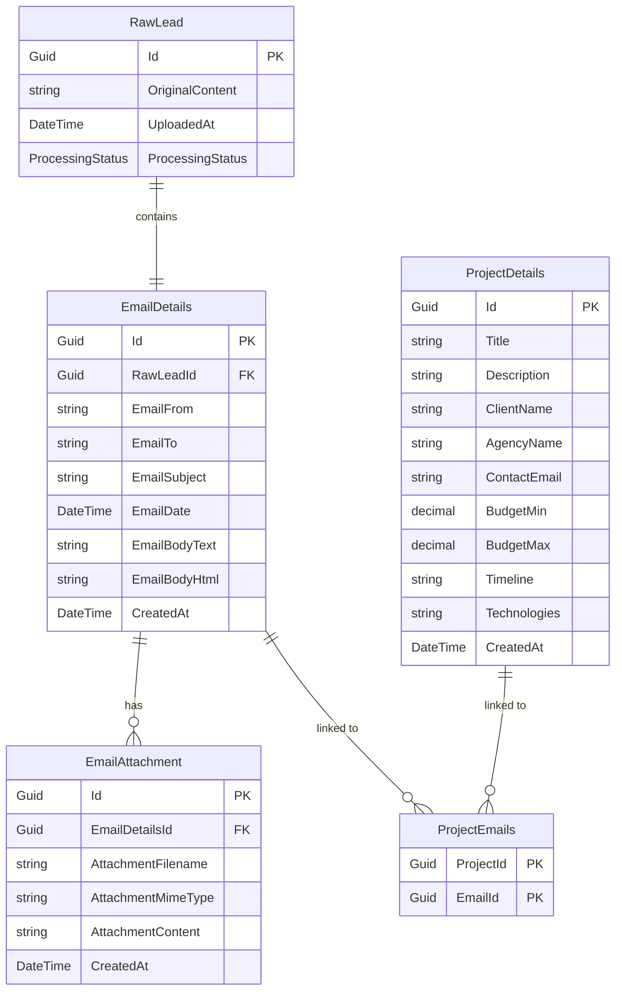

# NTLT ProjectRadar System Overview

## Backend

### Persistence: Database Structure

### API / Endpoints / DTOs

#### Controllers und Endpoints

| Controller | Endpoint | HTTP Method | Description |
|------------|----------|-------------|-------------|
| RawLeadsController | `/api/rawleads` | GET | Get all RawLeads with optional status filter |
| RawLeadsController | `/api/rawleads/{id}` | GET | Get specific RawLead by ID |
| RawLeadsController | `/api/rawleads/upload` | POST | Upload .eml file and create new RawLead |
| RawLeadsController | `/api/rawleads/{id}/status` | PATCH | Update processing status of RawLead |
| RawLeadsController | `/api/rawleads/{id}` | DELETE | Delete RawLead |
| EmailsController | `/api/emails` | GET | Get paginated list of emails |
| EmailsController | `/api/emails/{id}` | GET | Get detailed email information |
| EmailsController | `/api/emails/attachments/{attachmentId}` | GET | Download email attachment |
| ProjectsController | `/api/projects` | GET | Get all projects |
| ProjectsController | `/api/projects/{id}` | GET | Get project by ID |
| ProjectsController | `/api/projects` | POST | Create new project |
| ProjectsController | `/api/projects/{id}` | PUT | Update existing project |
| ProjectsController | `/api/projects/{id}` | DELETE | Delete project |
| ProjectsController | `/api/projects/by-email/{emailId}` | GET | Get projects linked to specific email |
| ProjectsController | `/api/projects/link-email` | POST | Link project to email |
| ProjectsController | `/api/projects/unlink-email` | DELETE | Unlink project from email |
| ProjectsController | `/api/projects/extract-from-email/{emailId}` | POST | Extract and create project from email |

#### DTOs

| DTO | Properties | Type |
|-----|------------|------|
| EmailAttachmentListDto | Id, AttachmentFilename, AttachmentMimeType | Guid, string, string |
| EmailListDto | Id, EmailFrom, EmailTo, EmailSubject, EmailDate, CreatedAt, HasAttachments, Attachments | Guid, string, string, string, DateTime?, DateTime, bool, IEnumerable<EmailAttachmentListDto> |
| EmailListResponseDto | Emails, TotalCount, Page, PageSize, TotalPages, HasNextPage, HasPreviousPage | IEnumerable<EmailListDto>, int, int, int, int, bool, bool |
| EmailAttachmentDto | Id, AttachmentFilename, AttachmentMimeType, AttachmentContent, CreatedAt | Guid, string, string, string, DateTime |
| EmailDetailsDto | Id, RawLeadId, EmailFrom, EmailTo, EmailSubject, EmailDate, EmailBodyText, EmailBodyHtml, CreatedAt, Attachments | Guid, Guid, string, string, string, DateTime?, string, string, DateTime, IEnumerable<EmailAttachmentDto> |
| ProjectDetailsDto | Id, Title, Description, ClientName, AgencyName, ContactEmail, BudgetMin, BudgetMax, Timeline, Technologies, CreatedAt | Guid, string?, string?, string?, string?, string?, decimal?, decimal?, string?, List<string>, DateTime |
| CreateProjectDetailsDto | Title, Description, ClientName, AgencyName, ContactEmail, BudgetMin, BudgetMax, Timeline, Technologies | string?, string?, string?, string?, string?, decimal?, decimal?, string?, List<string> |
| UpdateProjectDetailsDto | Title, Description, ClientName, AgencyName, ContactEmail, BudgetMin, BudgetMax, Timeline, Technologies | string?, string?, string?, string?, string?, decimal?, decimal?, string?, List<string> |
| ProjectEmailLinkDto | ProjectId, EmailId | Guid, Guid |

### Background Services

| Service | Funktion |
|---------|----------|
| EmailProcessingBackgroundService | **2-stufige sequenzielle Verarbeitung von .eml Dateien:**  1. **Email-Extraktion**: Parst .eml Inhalte und erstellt EmailDetails + EmailAttachment Datensätze  2. **KI-Projektextraktion**: Analysiert Email-Inhalte mit AI Service und erstellt automatisch ProjectDetails Datensätze für erkannte Projektanfragen  **Trigger**: Automatisch bei RawLead Upload, verarbeitet alle RawLeads mit Status "Processing" parallel |

## Frontend

### API connection

| Frontend Method | Backend Endpoint | Status | Bemerkungen |
|----------------|------------------|--------|-------------|
| `uploadEmlFile()` | `POST /api/rawleads/upload` | ✅ | Übereinstimmend |
| `getRawLead()` | `GET /api/rawleads/{id}` | ✅ | Übereinstimmend |
| `getRawLeads()` | `GET /api/rawleads` | ✅ | Übereinstimmend |
| `updateProcessingStatus()` | `PATCH /api/rawleads/{id}/status` | ✅ | Übereinstimmend |
| `deleteRawLead()` | `DELETE /api/rawleads/{id}` | ✅ | Übereinstimmend |
| `getEmails()` | `GET /api/emails` | ✅ | Übereinstimmend |
| `getEmailById()` | `GET /api/emails/{id}` | ✅ | Übereinstimmend |
| `downloadAttachment()` | `GET /api/emails/attachments/{attachmentId}` | ✅ | Übereinstimmend |
| `getProjects()` | `GET /api/projects` | ✅ | Übereinstimmend |
| `getProjectById()` | `GET /api/projects/{id}` | ✅ | Übereinstimmend |
| `createProject()` | `POST /api/projects` | ✅ | Übereinstimmend |
| `updateProject()` | `PUT /api/projects/{id}` | ✅ | Übereinstimmend |
| `deleteProject()` | `DELETE /api/projects/{id}` | ✅ | Übereinstimmend |
| `getProjectsByEmail()` | `GET /api/projects/by-email/{emailId}` | ✅ | Übereinstimmend |
| `linkEmailToProject()` | `POST /api/projects/{projectId}/emails/{emailId}` | ❌ | Frontend verwendet anderen Pfad als Backend (`/api/projects/link-email`) |
| `unlinkEmailFromProject()` | `DELETE /api/projects/{projectId}/emails/{emailId}` | ❌ | Frontend verwendet anderen Pfad als Backend (`/api/projects/unlink-email`) |

### Pages

| Route | Funktionalität |
|-------|----------------|
| `/` | Homepage mit Systemübersicht, Feature-Beschreibung und UI-Komponenten-Demo |
| `/upload` | Upload-Seite für .eml Dateien mit Drag & Drop Funktionalität und Upload-Progress |
| `/emails` oder `/emails/{id}` | Split-View Email-Client mit Email-Liste links und Email-Details rechts. Unterstützt direkte Navigation zu spezifischen Emails |
| `/projects` oder `/projects/{id}` | Split-View Projekt-Management mit Projekt-Liste links und Projekt-Details rechts. Unterstützt direkte Navigation zu spezifischen Projekten |
| `/search` | Suchseite für Projekte mit erweiterten Filteroptionen (Technologie, Standort, Status) |

